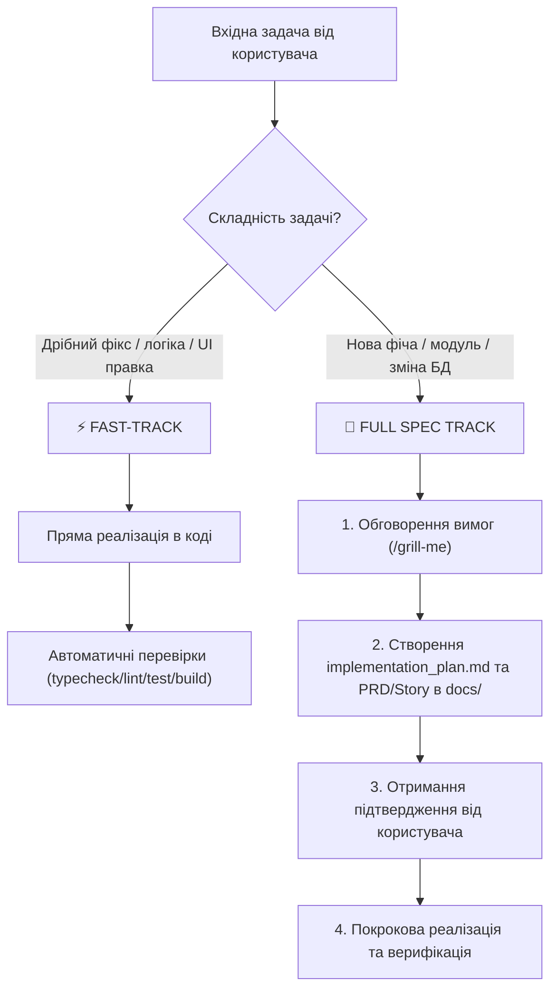

# BMAD Agile Workflow Skill

Цей скил визначає двоколійний порядок роботи агентів у проєкті `school-base`, натхненний **BMAD Method** (Breakthrough Method for Agile AI-Driven Development).

## 1. Класифікація задач (Два треки)

Перед тим як починати виконання будь-якої задачі, агент повинен визначити її складність та вибрати відповідний трек:

---

## 2. ⚡ Fast-Track (Швидкий трек)
Застосовується для:
- Виправлення багів (bug fixes).
- Дрібних рефакторингів та оптимізацій.
- Додавання невеликих UI елементів або текстів.
- Покращення стилів чи форматування.

**Порядок дій:**
1. Перевірити наявний контекст (CodeGraph, `agentmemory` recall).
2. Внести зміни в код відповідно до правил проєкту.
3. Провести обов'язкову 4-крокову перевірку: `typecheck` -> `lint` -> `test` -> `build`.
4. Зафіксувати зміни.

---

## 3. 📜 Full Spec Track (Повний специфікований трек)
Застосовується для:
- Створення нових сторінок, модулів або кастомних UI ролей.
- Змін у схемі Supabase (база даних, RLS-політики, Edge Functions).
- Великих архітектурних рефакторингів.

**Порядок дій:**
1. **Аналіз та брейншторм:** Провести `/grill-me` та уточнити вимоги з користувачем.
2. **Артефакти проекту:**
   - Для масштабних фіч створити PRD за шаблоном [`docs/templates/PRD-TEMPLATE.md`](file:///e:/_pet/school-base/docs/templates/PRD-TEMPLATE.md).
   - За потреби створити ADR рішення [`docs/templates/ADR-TEMPLATE.md`](file:///e:/_pet/school-base/docs/templates/ADR-TEMPLATE.md).
   - Декомпозувати задачу на User Stories за шаблоном [`docs/templates/USER-STORY-TEMPLATE.md`](file:///e:/_pet/school-base/docs/templates/USER-STORY-TEMPLATE.md).
   - Створити `implementation_plan.md` з прапорцем `request_feedback = true`.
3. **Затвердження:** Зупинитись і дочекатися явного схвалення від користувача.
4. **Виконання:** Реалізувати задачу крок за кроком (можливо за допомогою `subagent-driven-development`).
5. **Верифікація:**
   - Виконати автоматичні тести (`typecheck`, `lint`, `test`, `build`).
   - Перевірити RLS-безпеку та Toast-повідомлення.
   - Створити `walkthrough.md`.

---

## 4. Пам'ять та інсайти
- **Перед початком:** викликати `agentmemory` (`memory_recall` / `memory_smart_search`) для отримання попередніх рішень та правил.
- **Після завершення:** обов'язково викликати `memory_save` для збереження ключових архітектурних інсайтів.
