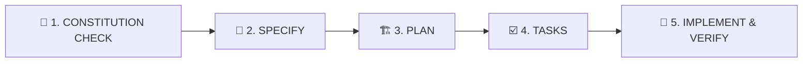

# Spec-Driven Development (SDD) Skill

Цей скил навчає ШІ-агентів працювати за методологією **Spec-Driven Development (SDD)** на основі фреймворку **github/spec-kit**. Специфікація та Конституція проєкту є вищим джерелом правди.

---

## 🔁 Покроковий SDD Пайплайн

Усі задачі з розробки нових фіч та модулів повинні слідувати 5 етапам:

---

### 1. 📜 Constitution Check (Перевірка Конституції)
Перед розробкою агент перевіряє відповідність запланованих правок законам з [`.spec/constitution.md`](file:///e:/_pet/school-base/.spec/constitution.md):
- [ ] Тексти виключно українською мовою.
- [ ] Сповіщення через Toast-повідомлення.
- [ ] RLS та суворі типи Supabase.
- [ ] Стандарти продуктивності та Web Vitals.

---

### 2. 📝 Specify (Формування специфікації)
Агент описує **ЩО** та **НАВІЩО** створюється, не прив'язуючись до деталей реалізації:
- Використовувати шаблони з [`docs/templates/PRD-TEMPLATE.md`](file:///e:/_pet/school-base/docs/templates/PRD-TEMPLATE.md) та [`docs/templates/USER-STORY-TEMPLATE.md`](file:///e:/_pet/school-base/docs/templates/USER-STORY-TEMPLATE.md).
- Документ специфікації зберігається у `docs/specs/`.

---

### 3. 🏗️ Plan (Технічне планування)
Агент перекладає специфікацію на технічну архітектуру:
- Визначення схеми Supabase, міграцій, RLS-політик, API маршрутів, UI компонентів.
- Створення `implementation_plan.md` з прапорцем `request_feedback = true`.
- Фіксація важливих архітектурних рішень за шаблоном [`docs/templates/ADR-TEMPLATE.md`](file:///e:/_pet/school-base/docs/templates/ADR-TEMPLATE.md).

---

### 4. ☑️ Tasks (Декомпозиція на атомарні таски)
Агент декомпозує план на чіткі, верифіковані кроки:
- Кожна таска повинна мати чіткі критерії приймання (Acceptance Criteria у форматі Given-When-Then).

---

### 5. 🚀 Implement & Verify (Реалізація та верифікація)
Агент реалізує кожну таску та виконує обов'язкову 4-крокову верифікацію:
1. `cd apps/web && npm run typecheck`
2. `npm --prefix apps/web run lint`
3. `npm --prefix apps/web run test`
4. `npm --prefix apps/web run build`

Звіт про виконану роботу зберігається у `walkthrough.md`.
